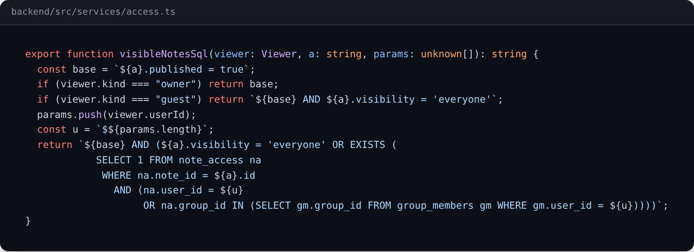
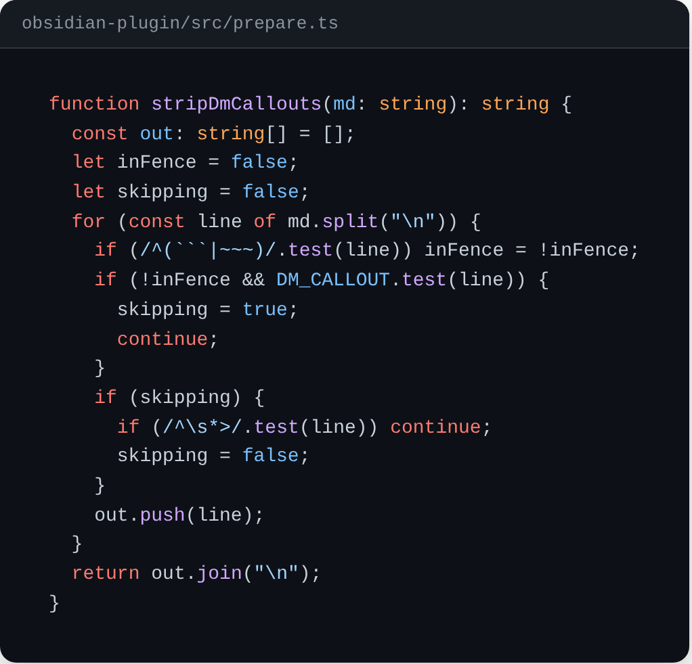
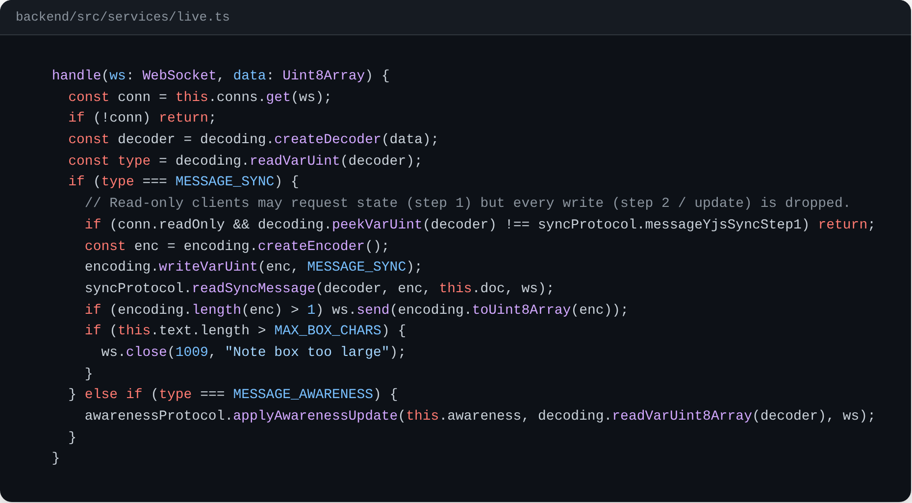

# A few pieces of the code

These are short excerpts from Lorekeeper. The full source is private, but I'm happy to share it on request.

## Deciding who can see a page

Every player-facing query in the backend builds its `WHERE` clause with this function, including page views, search and the live notes connection. Keeping it in one place means there's no way for one endpoint to forget a rule. The DM sees every published page, guests only see pages shared with everyone, and players also see pages shared with them or one of their groups.

## Stripping DM notes before upload

The Obsidian plugin removes private content before anything leaves the vault. This part drops callouts marked `[!dm]`, `[!gm]`, `[!secret]` or `[!private]`, including every quoted line that belongs to them, while leaving code blocks alone so examples of the syntax still show up. Comments and frontmatter are removed in other passes.

## Read-only live connections

The live notes boxes use the Yjs sync protocol over WebSockets. As the DM I can watch my players' notes, but I shouldn't be able to change them, so the server checks each incoming message. A read-only connection can still ask for the current document, but any message that would change it is ignored.

