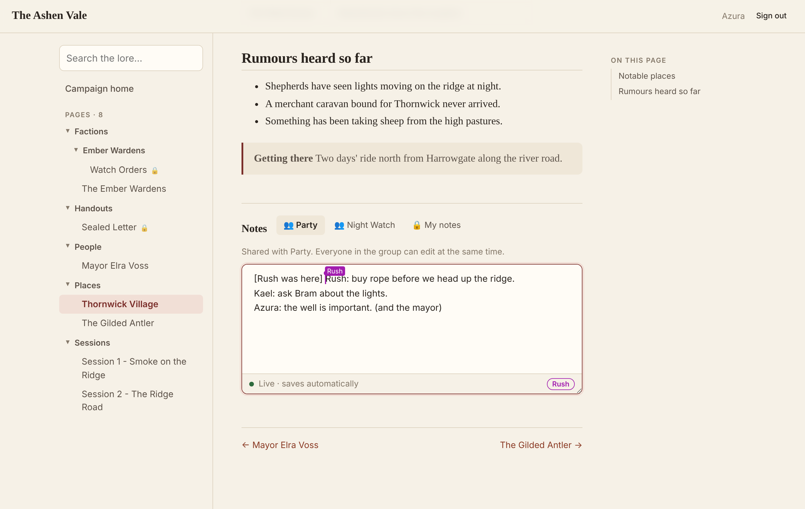
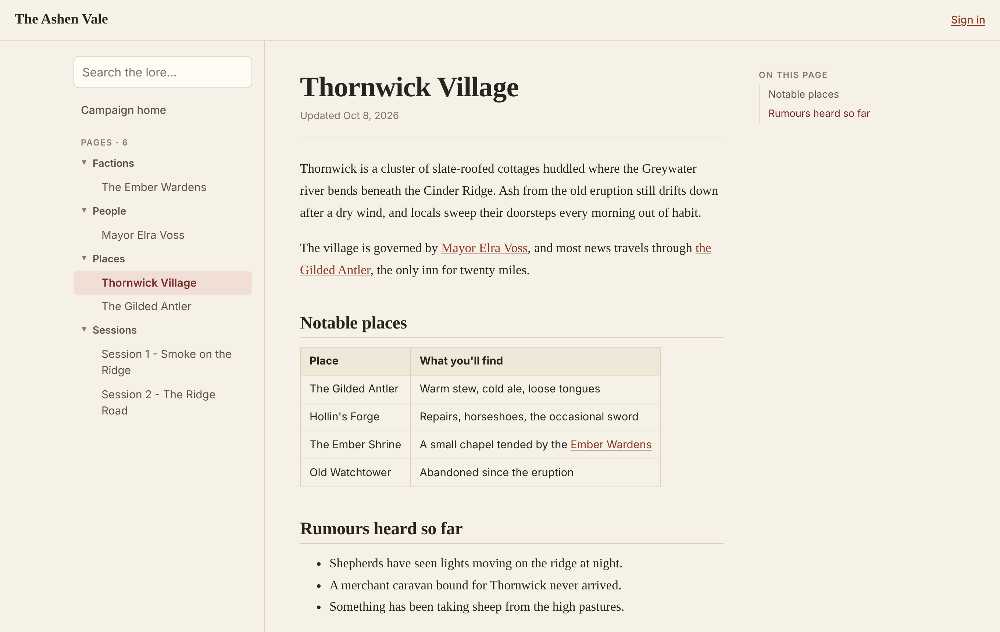
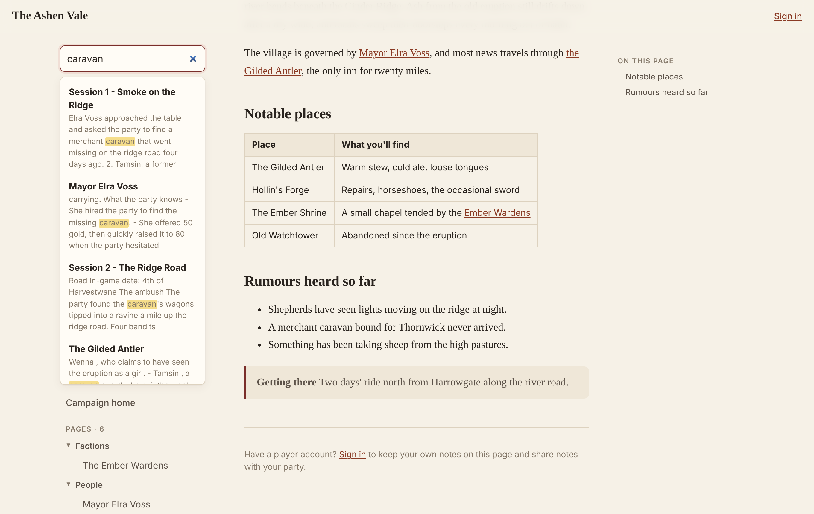
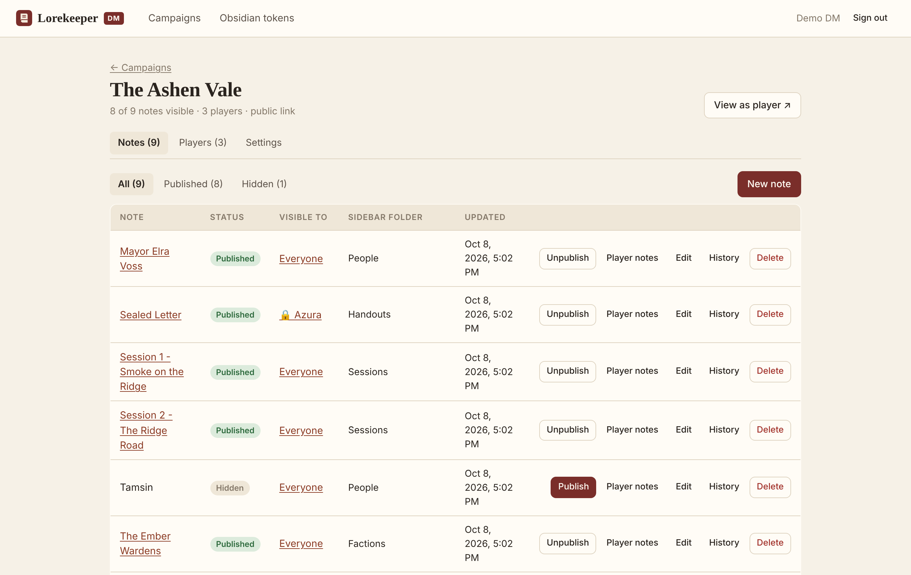
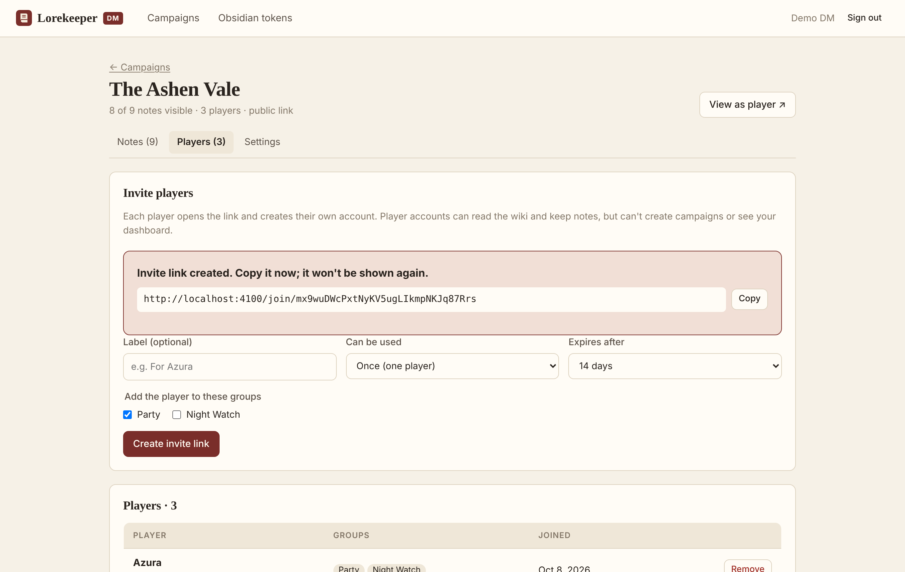
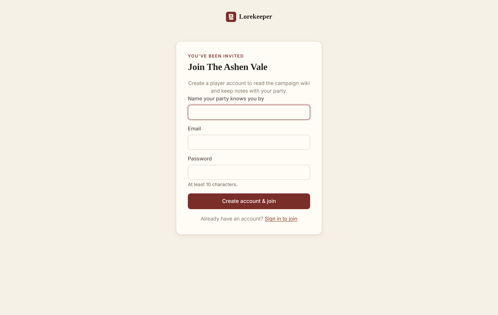
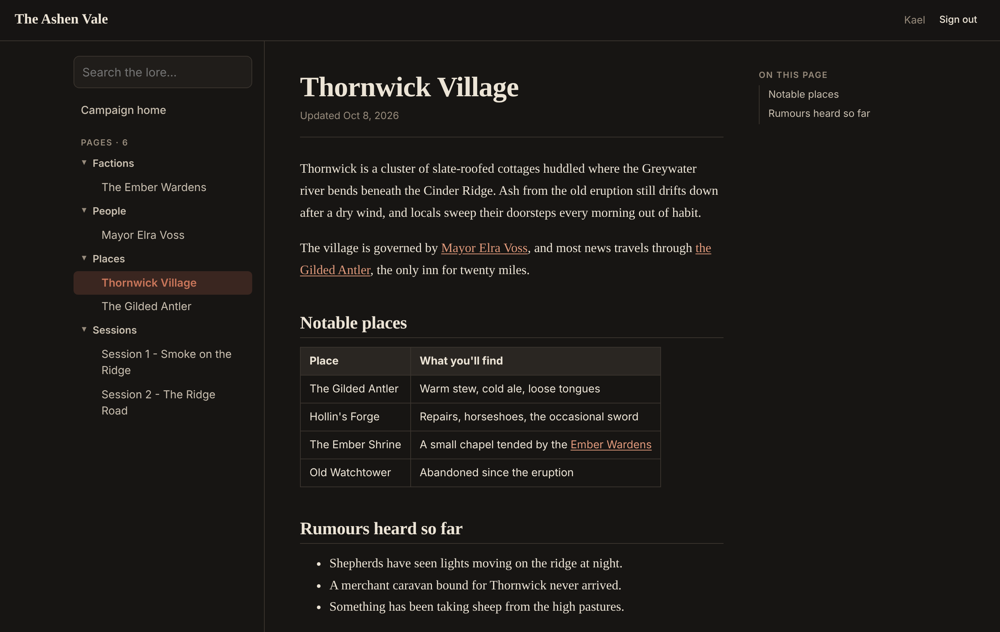
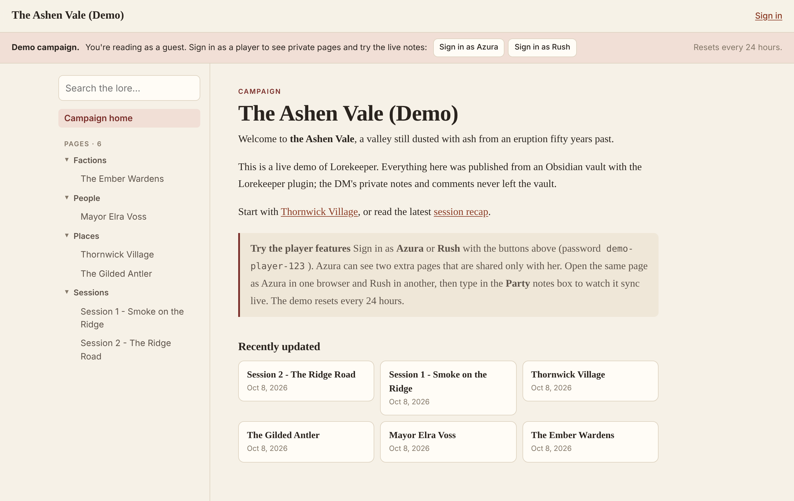

# Lorekeeper

A campaign wiki for D&D groups, published straight from an Obsidian vault.

[Try the live demo](https://lorekeeper-my6h.onrender.com/c/the-ashen-vale-demo) (no sign-up; it can take up to a minute to wake up on the free hosting tier)

## Why I built it

I run my campaigns out of Obsidian, and my notes mix things the players should know with things they definitely shouldn't. Sharing the safe parts meant copying text into Discord or a wiki and keeping it all in sync by hand. I wanted to publish specific notes from Obsidian with one command, have the private bits stripped automatically, and give my players somewhere to keep their own notes next to the lore.

## What it does

As the DM, I write in Obsidian like normal and publish notes with a plugin, one at a time or a folder at once. DM-only parts of a note, like Obsidian comments or callouts marked `[!dm]`, are removed on my machine before anything is uploaded. Players read everything on a website laid out like the vault, with search, an outline for each page, and wiki links that work like they do in Obsidian.

Players join through invite links and can be put in groups. Any page can be limited to certain groups or players with one line of frontmatter. Each page also has a private notes box for every player and a shared box for each group, and the shared boxes update live for everyone, cursors and all. I can pull those notes back into my vault from Obsidian.

| | |
|---|---|
|  |  |
|  |  |
|  |  |

## How it's built

The frontend is React and TypeScript with Vite, and the backend is Node.js and Express, also in TypeScript, talking to PostgreSQL with plain SQL. The live notes use Yjs, a CRDT library, over WebSockets with CodeMirror as the editor, which is why two people typing at once never overwrite each other. The Obsidian plugin is TypeScript too. Every version of a page that players could see is also committed to a separate Git repo, so there's a history of what was revealed and when.

The tests run against a real Postgres database, and there's a Playwright test that drives two browsers at once to check the live editing. The whole thing runs on a single Render web service with a Neon database, both on free tiers.

The part I spent the most time on was permissions. Every page a player requests, every search, and every live notes connection goes through the same SQL check, so there's one place that decides who sees what. A few of the more interesting pieces of code are in [CODE.md](CODE.md).

## The demo

The demo campaign is rebuilt from a sample vault every 24 hours. You can read it as a guest, or use the buttons at the top to sign in as one of two demo players. Azura can see two pages Rush can't. If you open the same page as Azura in one browser and Rush in another, you can watch the Party notes box sync as you type.

## Source code

The source for Lorekeeper is in a private repository. I'm happy to share it or walk through it, so feel free to reach out through [my GitHub profile](https://github.com/David-Olah).
